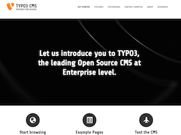
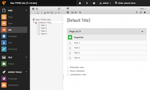

<ul class="breadcrumbs">
	<li>
		<a href="http://typo3.org/" target="_top" title="TYPO3 - The Enterprise Open Source CMS">typo3.org</a>
	</li>
	<li>
		<a href="http://typo3.org/download/" target="_top" title="Download">Download</a>
	</li>
	<li>Demo Distribution</li>
</ul>

Available Demos
===============

This is the landing page of all TYPO3 packages. Be welcome and make your choice between the different flavor.
There is here the opportunity to make an idea of the capability of TYPO3 products.
All packages have an login with different access level. Log in as admin in the Backend
for in depth exploration or as an Editor to see an optimized User Interface
addressing "basic" User. **Not all features are enabled such as file upload,
third-party extension installation, etc... for obvious security reasons.**

Experiment as much as you like but please let the system still usable
for the next visitor. Next reset will happen in <strong id="javascript_countdown_time"></strong>.

TYPO3 CMS LTS (6.2) - Introduction distribution
-----------------------------------------------

	

	Demo:
	 
	<a href="http://demo.typo3.org/cms62" target="_blank">http://demo.typo3.org/cms62</a>

	Backend login:
	 
	<a href="http://demo.typo3.org/cms62/typo3" target="_blank">http://demo.typo3.org/cms62/typo3</a>
	 
	Use <strong>"admin"</strong> and <strong>"password"</strong> as credentials

This is an example of a typical TYPO3 installation that bundles an XHTML template,
the TYPO3 source and some well-known extensions. Download this if you want to try out
TYPO3 and play around with it, or just to get a basic site with a predefined template up
and running. **To install, you need a webserver on your local machine or a hosted webserver**.
Unzip the package, create a Virtual Host pointing at the root of the directory,
open the browser and go to the installation wizard. Notice also, experimented users can install TYPO3 CMS LTS by [Composer][cp].

----

TYPO3 CMS (7.x)
---------------

	

	No Frontend yet, only a backend login:
	 
	<a href="http://demo.typo3.org/cms70/typo3" target="_blank">http://demo.typo3.org/cms70/typo3</a>
	 
	Use <strong>"admin"</strong> and <strong>"password"</strong> as credentials

This is our next CMS version which is in preparation. Check the [roadmap](http://typo3.org/typo3-cms/roadmap/) to
know more about the schedule. Huge parts of the backend will be rebuilt from the ground up using Twitter Bootstrap.
Doing so will enable us to implement a lot of usability improvements.
To install this version grab a fresh copy from the [download page](http://typo3.org/download).
Experimented users can install TYPO3 CMS 7.x by [Composer][cp].

Forge project
-------------

There is a [Forge project][fp] where issues and wishes can be [reported][bt].
For instance, if you would like to have your own distribution listed here showing
special features of a TYPO3 product, don't hesitate to create a ticket.

	[cp]: http://composer.typo3.org/
	[fp]: https://forge.typo3.org/projects/team-demo
	[bt]: https://forge.typo3.org/projects/team-demo/issues

